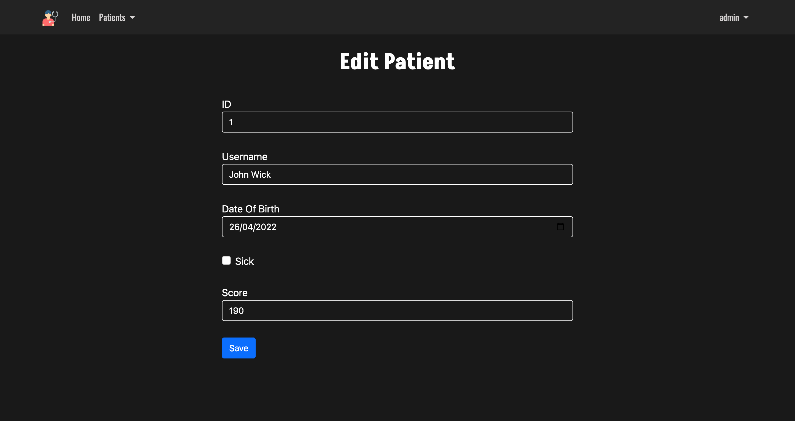

[](#contributors-)

<h1 align="center">
  <a href="https://github.com/ach-code/Resume-Portal">
   Patient App
  </a>
</h1>
<br>

<p align="center">
    <a href="#">
        
    </a>
    <a href="#">
        
    </a>
    <a href="#">
        
    </a>
    </br>
    <a href="#">
        
    </a>
    <a href="#">
        
    </a>
    <a href="#">
        
    </a>
    <a href="#">
        
    </a>
</p>

<details>
  <summary>Table of Contents</summary>
  <ol>
    <li>
      <a href="#about-the-project">About The Project</a>
      <ul>
        <li><a href="#built-with">Built With</a></li>
        <li><a href="#work-to-do">Work to do</a></li>
      </ul>
    </li>
    <li>
      <a href="#getting-started">Getting Started</a>
      <ul>
        <li><a href="#prerequisites">Prerequisites</a></li>
        <li><a href="#installation">Installation</a></li>
      </ul>
    </li>
  </ol>
</details>


## About The Project
<p>This project is a website that lists all patient information and has several features depending on the role [User,Admin,Anonymous]:<br>
                        User -> Home page, Search , View patient list<br>
                        Admin -> Home page, Add, Edit, Delete a patient<br>
                        Anonymous -> Home page, Login, Register</p>

</img> 
</img> 
</img> 
</img> 
</img> 
</img>
### Work to do
</img>


### Built With

* [Java](https://www.java.com/en/)
* [Spring](https://spring.io/)
* [Spring Mvc](https://docs.spring.io/spring-framework/docs/3.2.x/spring-framework-reference/html/mvc.html)
* [Spring Security](https://spring.io/projects/spring-security)
* [Thymeleaf](https://www.thymeleaf.org/)
* [Bootstrap 5](https://getbootstrap.com/)
* [Postgresql](https://www.postgresql.org/)

<p align="right">(<a href="#top">back to top</a>)</p>


<!-- GETTING STARTED -->
## Getting Started

### Prerequisites

You need to install Java JDK and java ide like IntelliJ IDEA or Eclipse ...
* JDK
  ```sh
  https://www.oracle.com/java/technologies/downloads/
  ```

* IntelliJ IDEA
    ```sh
    https://www.jetbrains.com/idea/
    ```
### Installation

1. Clone the repo
   ```sh
   git clone https://github.com/ach-code/Patient-Spring-Mvc.git
   ```
2. Install JDK
   ```sh
    https://www.jetbrains.com/idea/
   ```
3. Install all pom.xml dependency 
   ```sh
   mvn install
   ```

<p align="right">(<a href="#top">back to top</a>)</p>
